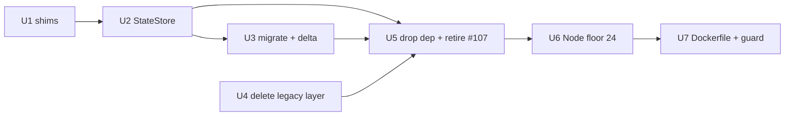

# refactor: Replace better-sqlite3 with node:sqlite

## Summary

Remove the compiled `better-sqlite3` dependency and drive the durable state store with the standard library's `node:sqlite` instead. The native binding has broken the server three times — #88 (Cursor launcher), #95 (jbctech-main launcher), and 2026-08-10 (test suite) — always with the same shape: the Node that compiled the binding is not the Node loading it. #99 made that failure legible and #107 made it self-heal on dev machines, but neither can reach an end user's npx cache, which is where #88 and #95 actually bit. Deleting the binding is the only fix that closes the class, because there is no ABI left to mismatch.

Ships as **v5.0.0**: `engines.node` moves to `>=24.0.0`, dropping Node 20 (EOL April 2026) and Node 22. Three cleanups ride along because this change makes them free or necessary — the dead legacy database layer, #107's now-purposeless auto-heal, and #109's Node 26 Dockerfile pin.

Store behavior, on-disk format, and schema version are unchanged. This is a driver swap plus two small shims, not a redesign of state persistence.

---

## Problem Frame

`better-sqlite3` compiles a `.node` binding against a specific Node ABI. Any path where the compiling Node differs from the loading Node produces `ERR_DLOPEN_FAILED` or a `NODE_MODULE_VERSION` mismatch, and until #77 that crashed the server before the MCP handshake — the in-memory fallback was backed by the same native module that had just failed to load.

Mitigations to date and what each leaves open:

| Change | What it did | What it cannot reach |
|---|---|---|
| #77 (v4.2.1) | Fail fast with an actionable message instead of a raw dlopen stack | The mismatch itself |
| #99 (v4.4.0) | Pin the build toolchain to Node 24 LTS; name the offending binding | A consumer whose launcher Node differs from the cache's compile Node |
| #107 | Auto-rebuild an unloadable binding on `pretest` / `prestart:dev` | End users — `scripts/` is not published, so the hook cannot ship |

`node:sqlite` is in the standard library, so there is no artifact to compile, cache, or mismatch. Its availability is version-dependent, verified directly rather than taken from release notes:

| Node | `require('node:sqlite')` unflagged |
|---|---|
| 22.11.0 | fails — `No such built-in module` (needs `--experimental-sqlite`) |
| 22.13.0 | works, emits `ExperimentalWarning` |
| 22.15.0 | works, emits `ExperimentalWarning` |
| 24.18.0 | works, silent |

The module is under active development / release-candidate status rather than fully stable, which is a deliberate accepted risk: the surface this store uses (`DatabaseSync`, `prepare`, `run`, `get`, `all`, `exec`) is the long-settled core, and the alternative is keeping a dependency that has broken production three times.

---

## Requirements

- **R1.** The durable state store reads and writes existing `state.db` files with no migration, format change, or `user_version` bump.
- **R2.** `better-sqlite3` is absent from `dependencies` and from the installed tree.
- **R3.** Store behavior is preserved exactly — WAL journal mode, busy timeout, transaction atomicity, degraded-mode fallback, and delta-store semantics all behave as they do today.
- **R4.** `engines.node` is `>=24.0.0`; CI exercises 24.x and 26.x.
- **R5.** No `ExperimentalWarning` is emitted on any supported Node version.
- **R6.** The shipping container builds and runs on the same LTS line the package requires.

---

## Key Technical Decisions

**Node floor at 24, not 22.5.** `node:sqlite` works unflagged on 22.5+, but Node 22 emits `ExperimentalWarning: SQLite is an experimental feature` on stderr at startup. For a stdio MCP server whose stderr is surfaced by hosts, that is noise on every launch. Node 24 is silent, and the floor then matches `.tool-versions`, `release.yml`, and `integration.yml`. Cost: Node 22 is in maintenance LTS until April 2027, so some consumers stay on v4.x. Confirmed acceptable — all local launchers already run 24.18.0.

**Preserve the store's on-disk contract, not its driver API.** SQLite's file format is driver-independent, so no data migration is required. The migration is source-level only.

**Pin `enableForeignKeyConstraints: false` explicitly.** `node:sqlite` defaults foreign-key enforcement **on**; better-sqlite3 inherits SQLite's default of **off**. The current state schema declares no FK constraints, so this is inert today — but leaving it implicit means a future schema silently inherits enforcement as a side effect of a driver choice made in 2026. Pin it, and let enabling enforcement be its own deliberate change.

**Read pragmas positionally, not by name.** `db.prepare('PRAGMA busy_timeout').get()` returns `{timeout: 5000}` — the column is `timeout`, not `busy_timeout`. A shim that indexes by pragma name works for `journal_mode` and silently returns `undefined` for `busy_timeout`. Take the first value of the row.

**Delete the legacy database layer rather than porting it.** `src/database/connection.ts` is never constructed anywhere; `src/database/repository.ts` is imported exclusively as `import type`. Porting ~23 query sites that cannot execute would be pure waste.

---

## Verified Compatibility

Probed directly against Node 24.18.0 rather than inferred from docs. Behaviors that match better-sqlite3 and need no adaptation:

| Behavior | better-sqlite3 | node:sqlite |
|---|---|---|
| Named params `@x` / `:x`, positional `?` | supported | supported |
| INTEGER column return type | `number` | `number` (not BigInt) |
| `run()` return shape | `{changes, lastInsertRowid}` | identical |
| `get()` on no rows | `undefined` | `undefined` |
| Binding `undefined` or a boolean | throws | throws |
| `PRAGMA journal_mode = WAL` on a file db | applies | applies |
| Manual `BEGIN` / `COMMIT` / `ROLLBACK` | works | works |

Differences requiring action, all handled in U1/U2:

| Difference | Impact | Handling |
|---|---|---|
| No `.pragma()` helper | 4 call sites | Shim (U1) |
| No `.transaction()` wrapper | 5 call sites | Shim (U1) |
| Pragma reads keyed by column, not pragma name | Silent `undefined` | Read positionally (U1) |
| FK enforcement defaults on | None today (no FKs in schema) | Pin to `false` (U2) |
| Double-quoted string literals rejected | None (no DQS in state SQL — audited) | No action |

---

## Implementation Units

### U1. Pragma and transaction shims

**Goal:** Provide the two better-sqlite3 conveniences `node:sqlite` lacks, so U2/U3 are mechanical substitutions rather than per-site reinventions.

**Requirements:** R3

**Dependencies:** none

**Files:**
- `src/state/sqlite-compat.ts` (new)
- `tests/unit/state/sqlite-compat.test.ts` (new)

**Approach:** Two functions over a `DatabaseSync` handle. A `pragma(db, 'name')` read helper returning the row's first value (never indexed by pragma name), a `pragma(db, 'name = value')` set form routed through `exec`, and a `transaction(db, fn)` wrapper issuing `BEGIN`/`COMMIT` with `ROLLBACK` on throw, returning the callback's value. The transaction wrapper must not swallow the original error when the rollback itself fails — surface the original.

**Patterns to follow:** Keep the module dependency-free and side-effect-free, matching the shape of `src/state/migrate.ts`.

**Test scenarios:**
- `pragma(db, 'journal_mode')` on a WAL file db returns `'wal'` as a string
- `pragma(db, 'busy_timeout')` returns the numeric timeout — regression guard for the column-name trap, since the row key is `timeout`
- Setting form `pragma(db, 'busy_timeout = 5000')` applies and a subsequent read reflects it
- `transaction` returns the callback's return value unchanged
- `transaction` commits: rows written inside are visible after return
- `transaction` rolls back on throw: no rows persist, and the original error propagates
- Consecutive transactions on the same handle behave — sequential begin/commit pairs do not error. Not nesting: `BEGIN` cannot run inside an active transaction, and no call site nests (all five callbacks only `prepare`/`run`/`exec`). If a future caller needs nesting, that requires `SAVEPOINT` support and is a separate change.

---

### U2. Migrate StateStore to node:sqlite

**Goal:** Swap the driver in the durable store while preserving open semantics, WAL, busy timeout, and degraded-mode fallback.

**Requirements:** R1, R3

**Dependencies:** U1

**Files:**
- `src/state/store.ts`
- `tests/unit/state/store.test.ts`
- `tests/unit/state/native-load-failure.test.ts`

**Approach:** Replace the `better-sqlite3` import with `DatabaseSync` from `node:sqlite`, passing `enableForeignKeyConstraints: false`. Route the 4 pragma sites and the 2 in-file transaction sites through U1's shims. The in-memory fallback paths (`:memory:`) construct the same way.

The native-load failure handling deserves deliberate treatment rather than mechanical porting: the elaborate ABI-mismatch diagnostics exist because the binding could fail to load. With no binding, that entire failure mode disappears. Reduce the handler to what can still fail — a corrupt or unreadable database file, and the forward-schema case #99 added — and delete the ABI-specific branch. `tests/unit/state/native-load-failure.test.ts` will need rewriting or removal accordingly; decide during implementation once the surviving failure modes are visible.

**Execution note:** Characterization-first. Before changing the driver, confirm the existing store tests pass and capture what they assert about journal mode, busy timeout, and degraded fallback — these are the invariants the swap must preserve.

**Test scenarios:**
- Opening an existing `state.db` written by the better-sqlite3 build reads its rows and reports the same `user_version` — the core no-migration guarantee (R1)
- A fresh store initializes with `journal_mode = wal` and the configured busy timeout
- `journalMode` and `busyTimeout` properties report correct values after open (guards the pragma-shape trap end to end)
- Degraded mode: an unopenable database file falls back without throwing, and `degraded` is true
- A forward-schema database (higher `user_version` than the build understands) still degrades with the #99 actionable message
- Transactional writes commit and are visible on reopen
- A write that throws mid-transaction leaves no partial rows

---

### U3. Migrate the migration runner and delta store

**Goal:** Move the remaining state modules off the better-sqlite3 type import and onto the shims.

**Requirements:** R1, R3

**Dependencies:** U1, U2

**Files:**
- `src/state/migrate.ts`
- `src/state/delta-store.ts`
- `tests/unit/state/migrate.test.ts`
- `tests/unit/state/delta-store.test.ts`

**Approach:** Both import `Database` as a type only; retype to `DatabaseSync`. Route their 3 transaction sites (1 in `migrate.ts`, 2 in `delta-store.ts`) through U1's wrapper. Schema migration must remain atomic — a failed migration step must leave `user_version` unchanged.

**Test scenarios:**
- A pending migration applies and advances `user_version` by exactly one step
- A migration that throws mid-statement rolls back fully and leaves `user_version` at its prior value
- Running migrations twice is idempotent — the second run applies nothing
- Delta commit writes cursor and rows atomically
- Delta wipe removes all rows for the target and leaves other targets intact

---

### U4. Delete the dead legacy database layer

**Goal:** Remove unreachable runtime code that would otherwise look like a second thing to migrate.

**Requirements:** R2

**Dependencies:** none (parallel with U1–U3)

**Files:**
- `src/database/connection.ts` (delete)
- `src/database/index.ts` (prune the connection re-export)
- `src/database/repository.ts` (retain — types only)
- corresponding tests under `tests/unit/database/` (delete those covering deleted runtime code)

**Approach:** `connection.ts` is never constructed outside `src/database/`. `repository.ts` is consumed by `src/graph/repository.ts`, `src/graph/mailbox-adapter.ts`, and the `*-graph.ts` tools exclusively via `import type` for `FolderRow`, `EmailRow`, and sibling interfaces — those must survive. Remove the runtime class and its `IConnection` dependency; keep the interface exports. If `repository.ts` still carries a runtime class body after the type exports are separated, evaluate splitting types into a dedicated module rather than leaving a class no one instantiates.

**Test scenarios:** `Test expectation: none -- deletion of unreachable code.` Verification is that `typecheck` and the full suite pass unchanged, proving nothing depended on the removed runtime surface.

---

### U5. Drop the dependency and retire the auto-heal

**Goal:** Remove `better-sqlite3` and the #107 machinery that exists solely to manage it.

**Requirements:** R2

**Dependencies:** U2, U3, U4

**Files:**
- `package.json`, `package-lock.json`
- `scripts/ensure-native.mjs` (delete)
- `tests/unit/native-abi-guard.test.ts` (delete)
- `docs/solutions/runtime-errors/mcp-server-crash-on-unloadable-better-sqlite3-2026-07-12.md` (annotate)

**Approach:** Remove `better-sqlite3` and `@types/better-sqlite3`; remove the `pretest`, `prestart:dev`, and `ensure-native` script entries. Delete the heal script and its guard test — with no binding, both are dead weight.

Do not delete the #77 learning doc. It documents a real diagnostic journey that stayed valuable long enough to catch a repeat of the same classifier bug in #107. Add a short note recording that v5.0.0 removed the native dependency and the failure mode no longer occurs, so a future reader knows the remedies describe historical builds.

**Test scenarios:**
- `Test expectation: none -- dependency and tooling removal.`
- Verification after a clean `rm -rf node_modules && npm install`: neither `better-sqlite3` nor `@types/better-sqlite3` appears anywhere in the tree. Check all three — a direct-path check alone misses a transitive copy some other dependency pulls in:
  - recursive search of `node_modules` (not just the top-level directory)
  - `package-lock.json` contains no entry for either package
  - `npm ls --all` reports neither
- The full suite passes.

---

### U6. Raise the Node floor to 24

**Goal:** Make the supported-version contract match what `node:sqlite` requires and what actually ships.

**Requirements:** R4, R5

**Dependencies:** U5

**Files:**
- `package.json` (`engines.node`)
- `.github/workflows/test.yml` (matrix)
- `tests/unit/toolchain-pins.test.ts`
- `README.md` (requirements section)

**Approach:** `engines.node` to `>=24.0.0`; test matrix to `[24.x, 26.x]`. The `toolchain-pins` guard already asserts even-major and `<= MAX_LTS_MAJOR`; add a floor assertion so a future edit cannot drop `engines` below the version `node:sqlite` needs. Note in the guard's header comment that the floor is now driven by a stdlib API requirement, not only by LTS policy — those are separate constraints that could otherwise be conflated when `MAX_LTS_MAJOR` is next bumped.

**Test scenarios:**
- `engines.node` parses to a major `>= 24`
- The CI matrix contains no entry below 24
- Existing even-major and max-LTS assertions still hold
- Guard fails if `engines.node` is edited below 24 (the regression this adds)

---

### U7. Repin the Dockerfile and close the guard gap (#109)

**Goal:** Stop shipping the container on a Node line the package no longer supports as its build target, and make the guard cover the file that slipped.

**Requirements:** R6

**Dependencies:** U6

**Files:**
- `Dockerfile`
- `tests/unit/toolchain-pins.test.ts`

**Approach:** Repin both the builder and runtime stages from `node:26-bookworm-slim` to the Node 24 LTS equivalent, and add the Dockerfile to the `PINS` table in the toolchain guard. These must land together — adding the guard entry before the repin turns CI red.

`node:26-bookworm-slim` is a floating tag, so what "26" resolves to drifts between rebuilds with no change in the repo. Consider digest-pinning as part of this unit; if that is deferred, record it under deferred work rather than leaving it unstated.

**Test scenarios:**
- The toolchain guard reads the Dockerfile and asserts an even-major LTS Node
- Both builder and runtime stages resolve to the same major (guards the split-stage drift that would reintroduce an ABI mismatch inside the image, were a native module ever reintroduced)
- Guard fails if either stage is edited to a non-LTS major

---

## Unit Dependencies

U4 is independent and can land first or in parallel; everything else is a chain.

---

## Scope Boundaries

**In scope:** the state-store driver swap, the two shims, deletion of the dead legacy database layer, removal of `better-sqlite3` and #107's auto-heal, the Node floor raise, and the Dockerfile repin with its guard gap.

**Non-goals:**
- Redesigning state persistence, the schema, or the durable-ID model
- Changing store behavior in any observable way
- Enabling foreign-key enforcement (explicitly pinned off to preserve parity; enabling it is its own change)

### Deferred to Follow-Up Work
- **#76 graceful no-sqlite degrade** — largely mooted once the store cannot fail to load a binding, but the degraded path still exists for unreadable or forward-schema files. Re-evaluate and close or narrow #76 after this lands rather than as part of it.
- **Digest-pinning the container base image** — if U7 lands on a tag rather than a digest.
- **Splitting `src/database/repository.ts` into a types-only module** — if U4 leaves a class body no one instantiates.

---

## System-Wide Impact

| Surface | Impact |
|---|---|
| npm consumers | **Breaking at runtime, not necessarily at install.** npm only *warns* on an unsatisfied `engines.node` by default; it rejects the install only under `engine-strict=true`. So a Node 20 or 22 user can install v5.0.0 and then fail at startup — Node 20 and Node 22 below 22.13 cannot load `node:sqlite` unflagged at all, and 22.13+ loads it with an `ExperimentalWarning`. Requires a major version and a release note leading with the floor change, since the default install path gives only a warning. |
| JP remote connector | Container rebuild and redeploy required by U7. Behavior unchanged; the store is a fresh volume per revision. |
| Local stdio launchers | None — all already run 24.18.0. Existing `state.db` files are read in place. |
| CI | Matrix drops two legs, shortening the run. The known Windows/Node-20 `Install dependencies` flake disappears with the 20.x leg. |
| Docs | README requirements section, CHANGELOG with a prominent breaking-change note. |

---

## Risks

| Risk | Likelihood | Mitigation |
|---|---|---|
| A behavioral difference in `node:sqlite` not caught by the compatibility probe corrupts or misreads a live `state.db` | Low | R1's reopen-existing-db test is the gate. Probe already covered params, return types, transactions, pragmas, and FK/DQS defaults. Store tests run against a real file db, not `:memory:` only. |
| Silent `undefined` from a pragma read keyed by name | Medium if unguarded | U1 reads positionally and carries a dedicated `busy_timeout` regression test — this is the trap most likely to pass review unnoticed. |
| Transaction shim mishandles nested or failed rollback, losing the original error | Low | Explicit test scenarios in U1 for rollback-on-throw and error propagation. |
| Dropping Node 22 strands a consumer | Low, accepted | Major version; Node 20 is EOL and 22 users remain on v4.x. Confirmed no local launcher affected. |
| `node:sqlite` API changes — the module is release-candidate / actively developed, not fully stable | Low-medium | The surface used (`DatabaseSync`, `prepare`, `run`, `get`, `all`, `exec`) is its long-settled core, and Node 24 is the floor so the flagged-module era is behind us. Accepted deliberately: the alternative is retaining a dependency that has broken production three times. If a breaking change does land, the shims in U1 are the single place adaptation is needed. |

---

## Operational / Rollout Notes

Release as **v5.0.0** with the engines change as the lead item in the changelog — this is the part that breaks people, and it should not be buried under the internal driver detail.

The JP connector redeploy is the one step with live blast radius. U7 changes the container base image, so the deploy is not a no-op:

1. Merge, tag, and publish as normal.
2. Push `main` to the `joshua-project` remote to trigger `deploy-connector`.
3. Verify the workflow's own health gate, then independently confirm `/healthz` and that the running image tag matches the release commit.
4. Confirm the connector reports `5.0.0` via an authenticated `initialize` before considering the rollout done.

Sequence the redeploy deliberately rather than letting it ride along unnoticed — the base-image change means the runtime moves from Node 26 to Node 24 at the same time as the driver swap, so a failure there has two plausible causes and is worth isolating.

---

## Deferred to Implementation

- Whether `tests/unit/state/native-load-failure.test.ts` is rewritten or deleted — depends on which failure modes survive in U2.
- Whether `src/database/repository.ts` needs a types/runtime split — visible only once U4's deletions are applied.
- Exact shim signatures and whether `transaction` needs a variadic-argument form — determined by the 5 call sites in U2/U3.
